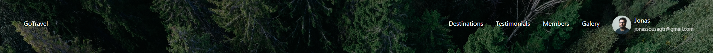
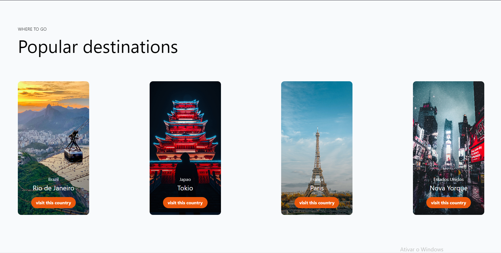
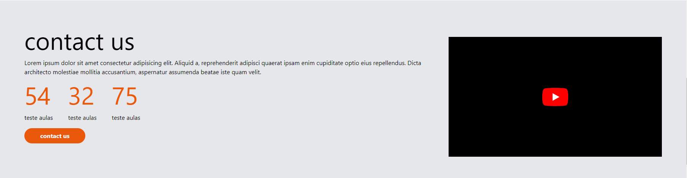
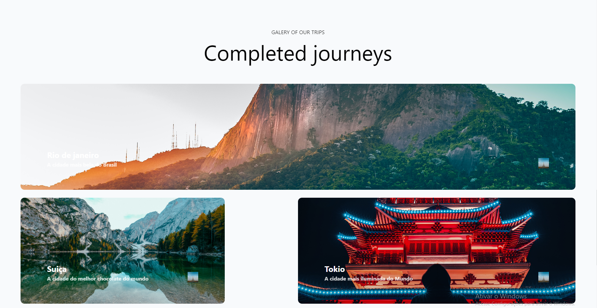
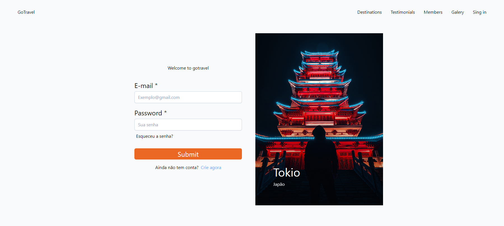
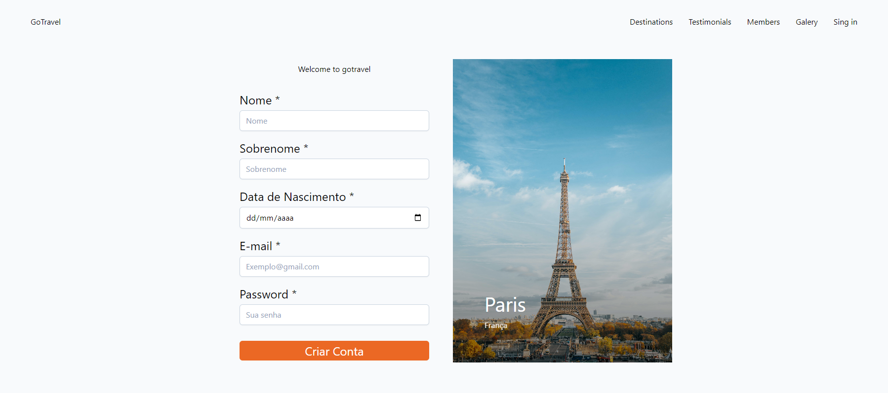
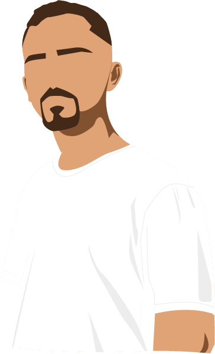

## 🚧Em Desenvolvimento🚧
# Projeto Gotravel  


O projeto Gotravel é um site para conhecer diferentes lugares incríveis do mundo, aonde você poderá adicionnar suas fotos de lugares e salvar suas fotos ou albuns favoritos.

## 📌Índice 
- <a href="#tecnologias-utilizadas">Tecnologias utilizadas</a>
- <a href="#proposito">Propósito</a>
- <a href="#funcionalidades-do-projeto">Funcionalidades do Projeto</a>
- <a href="#layout">Layout</a>
- <a href="#projeto">Projeto</a>
- <a href="#como-rodar-o-projeto">Como rodar o projeto</a>
- <a href="#autores">Autores</a>
- <a href="#novas-features">Novas features</a>

## 📱Tecnologias utilizadas
1. [Angular](https://angular.io/cli)
2. [Auth Guard](https://angular.io/api/router/CanActivate)
3. [Router](https://angular.io/guide/router)
4. [Observables](https://angular.io/guide/observables)

## 🎯Propósito
O propósito deste meu projeto pessoal é aprofundar meu conhecimento no framework Angular, construindo uma aplicação próxima a um projeto real, com o objetivo de explorar e dominar todas as funcionalidades do Angular ao desenvolver um site completo.

Até o momento, já desenvolvi a página inicial, o login e o cadastro. A página de login e cadastro estão funcionais, permitindo que os usuários se cadastrem e façam login. No entanto, vale ressaltar que o sistema de login atual é apenas simulado, uma vez que os dados são armazenados localmente e ainda não há interação com um backend para realizar as validações necessárias. Estou trabalhando nessa implementação e essa funcionalidade estará disponível nas próximas atualizações do site, juntamente com outras funcionalidades e seções, como a página de galeria (onde os usuários poderão enviar e salvar fotos) e a página de Destinos (onde serão exibidos os destinos mais populares do site).

Com este projeto, estou comprometido em aprimorar minhas habilidades no Angular e desenvolver uma aplicação completa, proporcionando uma experiência prática e próxima do mundo real.

## 🖥Funcionalidades do Projeto

✔ Tela principal<br>
✔ Tela de cadastro (você poode realmente se cadastrar)<br>
✔ Tela de login (você poode logar no site)<br>
✔ Seu usuário fica exibido no lado superior direito do site

## 🧩Layout









## 🎮Projeto
➡  [link do projeto](https://gotravel-omega.vercel.app/home) ⬅

## ⚠Como Rodar o Projeto
```bash
# Clone este repositório
$ git clone https://github.com/Jonas-Sousa/gotravel.git

# Acesse a pasta do projeto no seu terminal
$ cd gotravel

# Instale as dependências
$ npm install

# Execute a aplicação
$ ng serve
```
## 😎Autores 

  <br>
  <p>Jonas Sousa</p>
  
  
  [Linkedin](https://www.linkedin.com/in/jonas-sousa-dev/)
 
 
 ## 💡Novas features
⭕ Integração com backend para validação de login
⭕ Página de galeria para envio e salvamento de fotos
⭕ Página de Destinos com os destinos mais populares do site
⭕ Melhorias na página inicial para uma experiência aprimorada
⭕ Testes unitários para garantir a qualidade do código
