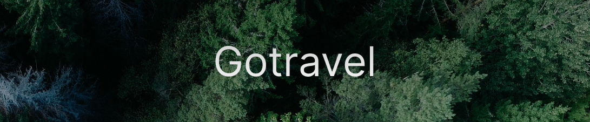

# Projeto Gotravel  



O projeto Gotravel é um site para conhecer diferentes lugares incríveis do mundo, aonde você poderá adicionnar suas fotos de lugares e salvar suas fotos ou albuns favoritos.
## 🚧Em Desenvolvimento🚧
## 📌Índice 
- <a href="#tecnologias-utilizadas">Tecnologias utilizadas</a>
- <a href="#proposito">Propósito</a>
- <a href="#funcionalidades-do-projeto">Funcionalidades do Projeto</a>
- <a href="#layout">Layout</a>
- <a href="#projeto">Projeto</a>
- <a href="#como-rodar-o-projeto">Como rodar o projeto</a>
- <a href="#autores">Autores</a>
- <a href="#novas-features">Novas features</a>

## 📱Tecnologias utilizadas
1. [Angular](https://angular.io/cli)

## 🎯Propósito

## 🖥Funcionalidades do Projeto

✔ <br>
✔ <br>
✔ <br>


## 🧩Layout


## 🎮Projeto
➡  [link do projeto](https://gotravel-omega.vercel.app/home) ⬅

## ⚠Como Rodar o Projeto
```bash
# Clone este repositório
$ git clone https://github.com/Jonas-Sousa/gotravel.git

# Acesse a pasta do projeto no seu terminal
$ cd gotravel

# Instale as dependências
$ npm install

# Execute a aplicação
$ ng serve
```
## 😎Autores 

  <br>
  <p>Jonas Sousa</p>
  
  
  [Linkedin](https://www.linkedin.com/in/jonas-sousa-dev/)
 
 
 ## 💡Novas features
- [ ] Feature nova 1
- [ ] Feature nova 2
- [ ] Feature nova 3
- [ ] Feature nova 4
- [ ] Feature nova 5
